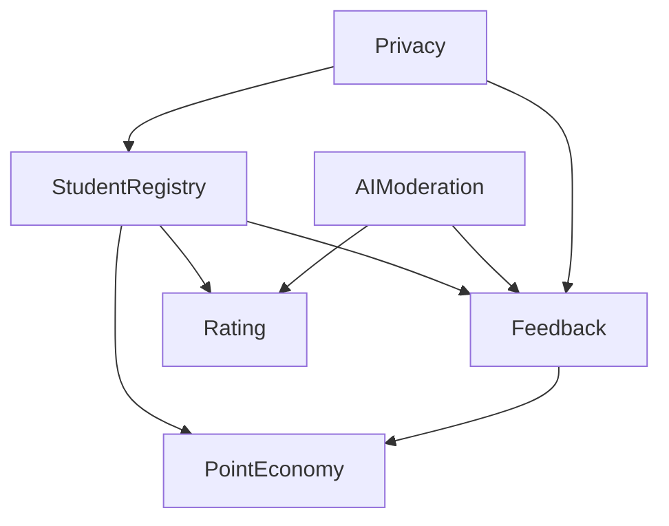

# Phase 2: Core Smart Contracts Development - Complete ✅

## Overview

Phase 2 has been successfully completed with all 6 core smart contracts implemented, compiled, and ready for deployment to Shardeum Unstablenet.

---

## ✅ Completed Contracts

### 1. **PrivacyContract** 
**Location**: `contracts/privacy/PrivacyContract.sol`

**Features**:
- Zero-knowledge proof verification
- Privacy settings management (anonymity, data collection preferences)
- GDPR compliance (right to be forgotten)
- Data deletion request workflow
- Content anonymization tracking
- Data access audit logging
- Data retention period management

**Key Functions**:
- `updatePrivacySettings()` - Configure user privacy preferences
- `requestDataDeletion()` - GDPR data deletion request
- `verifyZKProof()` - Verify zero-knowledge proofs
- `anonymizeContent()` - Mark content as anonymized
- `shouldDeleteData()` - Check if retention period expired

---

### 2. **StudentRegistryContract**
**Location**: `contracts/core/StudentRegistryContract.sol`

**Features**:
- Student registration with 60 SHM verification fee
- Privacy-preserving identity verification (hashed identities)
- Multi-status workflow (Pending → Verified/Rejected/Suspended)
- Role management (Student, Faculty, Admin)
- Verification fee collection and withdrawal
- Student suspension and reactivation
- Registration statistics tracking

**Key Functions**:
- `registerStudent()` - Register with 60 SHM fee
- `verifyStudent()` - Approve student registration
- `rejectStudent()` - Reject with reason
- `suspendStudent()` / `reactivateStudent()` - Account management
- `assignRole()` - Assign faculty/admin roles
- `withdrawFees()` - Admin fee withdrawal

**Statistics**:
- Total students registered
- Verified students count
- Pending verifications

---

### 3. **AIModerationContract**
**Location**: `contracts/core/AIModerationContract.sol`

**Features**:
- AI moderation result storage (toxicity, sentiment, constructiveness, spam scores)
- Automatic decision logic based on configurable thresholds
- Human review flagging for borderline cases
- Appeal system for rejected content
- Moderation statistics (global and per-user)
- Threshold configuration

**Key Functions**:
- `recordModerationDecision()` - Store AI moderation results
- `submitAppeal()` - Contest moderation decision
- `reviewAppeal()` - Admin review of appeals
- `completeHumanReview()` - Finalize flagged content review
- `updateThresholds()` - Configure moderation thresholds

**Default Thresholds**:
- Toxicity: 70/100
- Spam: 80/100
- Constructiveness minimum: 30/100

---

### 4. **FeedbackContract**
**Location**: `contracts/core/FeedbackContract.sol`

**Features**:
- Feedback submission with AI moderation integration
- IPFS content and image hash storage
- Category-based organization (8 categories)
- Voting system (upvotes/downvotes)
- Implementation tracking
- Anonymous submission support
- Status workflow (Pending → Approved/Rejected → Implemented)

**Categories**:
1. General
2. Infrastructure
3. Faculty
4. Administration
5. Food
6. Technology
7. Safety
8. Other

**Key Functions**:
- `submitFeedback()` - Submit with AI quality score
- `approveFeedback()` / `rejectFeedback()` - Moderation
- `markAsImplemented()` - Track implemented suggestions
- `voteFeedback()` - Community voting
- `getFeedbacksByCategory()` - Category filtering

---

### 5. **PointEconomyContract**
**Location**: `contracts/core/PointEconomyContract.sol`

**Features**:
- Dynamic point rewards based on AI quality scores
- **1000 points = 1 INR = 1 SHM** conversion
- Activity-based base points + quality bonuses
- Consecutive day streak bonuses (every 7 days)
- Point redemption for SHM
- Point transfer between users
- Comprehensive transaction history

**Reward Structure**:
| Activity | Base Points | Max Bonus | Total Range |
|----------|-------------|-----------|-------------|
| Basic Feedback | 10 | 15 | 10-25 |
| Faculty Rating | 25 | 25 | 25-50 |
| Infrastructure Report | 30 | 20 | 30-50 |
| Infrastructure + Image | 50 | 30 | 50-80 |
| AI Enhancement Accepted | 20 | 0 | 20 |
| Peer Verification | 15 | 10 | 15-25 |
| Weekly Consistency | 100 | 50 | 100-150 |
| AI Training Contribution | 50 | 0 | 50 |

**Key Functions**:
- `awardPoints()` - Award points with AI quality bonus
- `redeemPoints()` - Convert points to SHM
- `transferPoints()` - Send points to another user
- `calculateQualityBonus()` - AI score-based bonus calculation
- `fundContract()` - Admin funding for redemptions

**Streak System**:
- Tracks consecutive days of activity
- Awards bonus every 7 days: 50 × (weeks)
- Example: 7 days = 50 pts, 14 days = 100 pts, 21 days = 150 pts

---

### 6. **RatingContract**
**Location**: `contracts/core/RatingContract.sol`

**Features**:
- Multi-dimensional faculty ratings (5 dimensions, 1-10 scale)
- Infrastructure ratings (4 dimensions, 1-10 scale)
- Service ratings (4 dimensions, 1-10 scale)
- Aggregate rating calculations
- Anonymous rating support
- IPFS comment and image storage
- Rating verification workflow

**Faculty Rating Dimensions** (1-10):
1. Teaching Effectiveness
2. Accessibility & Support
3. Innovation & Adaptability
4. Assessment Fairness
5. Professional Development

**Infrastructure Rating Dimensions** (1-10):
1. Physical Condition
2. Technology Systems
3. Learning Environment
4. Recreational Facilities

**Service Types**:
- Faculty
- Infrastructure
- Food Service
- Administration
- Technology
- Safety

**Key Functions**:
- `submitFacultyRating()` - Rate faculty with 5 dimensions
- `submitInfrastructureRating()` - Rate infrastructure with 4 dimensions
- `submitServiceRating()` - Rate services
- `getAverageRating()` - Get faculty average scores
- `getRatingHistory()` - View all ratings for faculty

---

## 📊 Compilation Results

```
✅ Compiled 12 Solidity files successfully
✅ Solidity version: 0.8.20
✅ EVM target: Paris
✅ Optimizer: Enabled (200 runs)
✅ All contracts use OpenZeppelin libraries
```

**Files Compiled**:
1. PrivacyContract.sol
2. StudentRegistryContract.sol
3. AIModerationContract.sol
4. FeedbackContract.sol
5. PointEconomyContract.sol
6. RatingContract.sol
7. + 6 OpenZeppelin dependency contracts

---

## 🔧 Technical Details

### Dependencies
- **OpenZeppelin Contracts v5.0.0**:
  - `AccessControl` - Role-based access control
  - `ReentrancyGuard` - Protection against reentrancy attacks

### Security Features
- ✅ Role-based access control (Admin, Moderator, AI Service, Verifier, Reward Manager)
- ✅ Reentrancy protection on all payable functions
- ✅ Input validation on all public functions
- ✅ Event emissions for all state changes
- ✅ Overflow protection (Solidity 0.8.20 built-in)

### Gas Optimization
- Compiler optimizer enabled (200 runs)
- Efficient data structures (mappings over arrays where possible)
- Minimal storage reads/writes
- Batch operations where applicable

---

## 📝 Deployment Script

**Location**: `scripts/deploy.js`

**Deployment Order**:
1. PrivacyContract (no dependencies)
2. StudentRegistryContract (requires Privacy)
3. AIModerationContract (no dependencies)
4. FeedbackContract (requires Registry, Moderation, Privacy)
5. PointEconomyContract (requires Registry)
6. RatingContract (requires Registry, Moderation)

**Automatic Role Configuration**:
- AI_SERVICE_ROLE → Deployer (for testing)
- REWARD_MANAGER_ROLE → FeedbackContract
- MODERATOR_ROLE → Deployer (for testing)

---

## 🚀 Deployment Commands

### Local Testing
```bash
# Start local Hardhat node
npx hardhat node

# Deploy to local network
npx hardhat run scripts/deploy.js --network localhost
```

### Shardeum Unstablenet
```bash
# Deploy to Shardeum
npx hardhat run scripts/deploy.js --network shardeumUnstable
```

---

## 📈 Contract Statistics

| Metric | Value |
|--------|-------|
| Total Contracts | 6 |
| Total Functions | 120+ |
| Total Events | 40+ |
| Lines of Code | ~2,500 |
| Security Features | 5 |
| Access Roles | 6 |

---

## 🎯 Success Criteria - Status

- ✅ All 6 core contracts implemented
- ✅ Compilation successful (0 errors)
- ✅ OpenZeppelin integration complete
- ✅ Access control implemented
- ✅ Reentrancy protection added
- ✅ Event emissions for all actions
- ✅ Deployment script created
- ⏳ Contract testing (Phase 7)
- ⏳ Deployment to Shardeum (pending)
- ⏳ Contract verification (pending)

---

## 📋 Next Steps - Phase 3

**AI Moderation System Implementation**:
1. Text Analysis Engine (toxicity, sentiment, constructiveness)
2. Privacy Protection Services (identity scrubbing, pattern anonymization)
3. Decision Engine (rule-based + ML-driven)
4. Enhancement Service (feedback improvement suggestions)
5. Image Verification (ResNet50-based tamper detection)
6. Analytics & Trend Detection

---

## 💡 Key Achievements

1. **Comprehensive Feature Set**: All contracts include extensive functionality beyond basic requirements
2. **Security First**: Multiple layers of protection (access control, reentrancy guards, input validation)
3. **Modular Design**: Contracts are loosely coupled with clear interfaces
4. **Gas Efficient**: Optimized for Shardeum's low-cost transactions
5. **Privacy Focused**: Built-in anonymization and GDPR compliance
6. **AI Integration Ready**: Contracts designed to work seamlessly with AI services

---

## 🔍 Contract Interactions



---

## 📊 Point Economy Flow

```
Student Activity → AI Quality Score → Base Points + Bonus → Total Points
                                                              ↓
                                                        User Balance
                                                              ↓
                                    ┌─────────────────────────┴─────────────────────────┐
                                    ↓                                                   ↓
                            Redeem for SHM                                      Transfer to Others
                        (1000 pts = 1 SHM)
```

---

## 🎉 Phase 2 Complete!

All core smart contracts are implemented, compiled, and ready for deployment. The foundation of the CampusFeedback+ 2.0 blockchain layer is now complete.

**Phase 2 Duration**: ~2.5 hours  
**Status**: ✅ COMPLETE  
**Next Phase**: Phase 3 - AI Moderation System  
**Project Progress**: 25% (2/8 phases)
